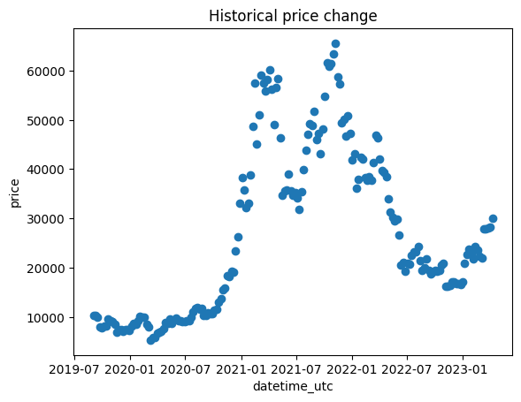

# Stock price's Historical Data Visualization

This code retrieves historical price data from Binance and visualizes historycal asset cycles as a scatter plot using PySpark, Matplotlib and visualize in Jupyter Notebook.

See notebook [example](./BTC_STOCK_PRICE_ANALYSIS.ipynb)

# Prerequisites

This code requires the following packages to be installed:
* pyspark
* matplotlib
* binance
* pandas
* Jupyter Notebook

# Usage

Before running the code, you must set the environment variables BINANCE_API_KEY and BINANCE_API_SECRET to your Binance API key and secret, respectively.

```bash
export BINANCE_API_KEY="****"
export BINANCE_API_SECRET="********"
```

# Demo


                    

 # References:
* [Binance API](https://python-binance.readthedocs.io/en/latest/binance.html?highlight=get_all_orders)
